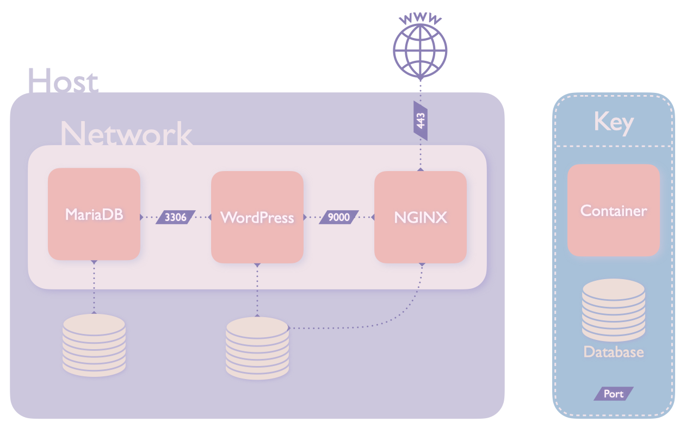

# inception

*A System Administration related exercise.*

<!-- TOC -->
* [inception](#inception)
  * [The Challenge](#the-challenge)
    * [Requirements:](#requirements-)
  * [Concepts](#concepts)
    * [Docker](#docker)
      * [How Docker Works](#how-docker-works)
      * [How Docker Compose Works](#how-docker-compose-works)
      * [Setting up images with or without Docker Compose](#setting-up-images-with-or-without-docker-compose)
      * [Docker vs Virtual Machines](#docker-vs-virtual-machines)
      * [Network](#network)
      * [Volumes](#volumes)
    * [NGINX](#nginx)
    * [MariaDB](#mariadb)
    * [WordPress](#wordpress)
  * [Useful Docker Commands](#useful-docker-commands)
    * [Docker](#docker)
    * [Docker Compose](#docker-compose)
  * [Implementation](#implementation)
    * [Docker Compose](#docker-compose)
      * [Network](#network)
      * [Volumes](#volumes)
      * [Containers](#containers)
      * [.env file](#env-file)
    * [Dockerfiles](#dockerfiles)
      * [MariaDB](#mariadb)
      * [WordPress](#wordpress)
      * [NGINX](#nginx)
    * [Virtual Machine and Shared Folder](#virtual-machine-and-shared-folder)
    * [Final Thoughts](#final-thoughts)
<!-- TOC -->

## The Challenge
This project focuses on system administration using Docker.  The purpose is to create a WordPress website that is hosted by NGINX and has a MariaDB database. 

### Requirements:
- WordPress, NGINX and MariaDB all have their own containers and communicate with each other using a single Docker network. 
- Two volumes have to be created, one for the MariaDB database and one for the WordPress website files. 
- Write our own Dockerfiles, one for each service.
- All images, networks, and volumes should be set up by a single docker-compose.yml file.
- The project has to be done on a Virtual Machine.

The subject provided a similar diagram to the one below to demonstrate the required structure of the project:
<div style="text-align: center;">

</div>

## Concepts
The following are brief explanations and definitions of the concepts introduced in this project.
* [Docker](#docker)
  * [How Docker Works](#how-docker-works)
  * [How Docker Compose Works](#how-docker-compose-works)
  * [Setting up images with or without Docker Compose](#setting-up-images-with-or-without-docker-compose)
  * [Docker vs Virtual Machines](#docker-vs-virtual-machines)
  * [Network](#network)
  * [Volumes](#volumes)
* [NGINX](#nginx)
* [MariaDB](#mariadb)
* [WordPress](#wordpress)

### Docker
[docs.docker.com](https://docs.docker.com/get-started/overview/) describes Docker as: _"an open platform for developing, shipping, and running applications. Docker enables you to separate your applications from your infrastructure so you can deliver software quickly."_

#### How Docker Works
_"Docker packages, provisions and runs containers. Container technology is available through the operating system: A container packages the application service or function with all of the libraries, configuration files, dependencies and other necessary parts and parameters to operate. Each container shares the services of one underlying operating system. Docker images contain all the dependencies needed to execute code inside a container, so containers that move between Docker environments with the same OS work with no changes."_ 
<br><br> [[source](https://www.techtarget.com/searchitoperations/definition/Docker)]

#### How Docker Compose Works
Docker Compose allows you to define and run multiple Docker containers through a single command.  Instead of starting up each container and service individually you can set up a YAML file that allows you to configure and start your application with the single command `docker compose`. This YAML file is called `docker-compose.yml`.
<br><br>[[source](https://docs.docker.com/compose/)]

#### Setting up images with or without Docker Compose
When you use Docker Compose to set up images, usually by calling Dockerfiles, it allows you to set up multiple images using one command, as well as other common objects that are shared such as volumes and networks. However, without Docker Compose you have to set up each image individually and manually add volumes and networks to each image.  Not only is this quite tedious it is also prone to user error, especially if you have to change something in the configuration as you then have to manually take down each image.  Whereas with Docker Compose it is just a single command. 

#### Docker vs Virtual Machines

|             | DOCKER                                                                                 | VM                                                                                |
|:------------|----------------------------------------------------------------------------------------|-----------------------------------------------------------------------------------|
| OS          | Shares an operating system with their host, which means they consume less resources.   | Designed to emulate virtual hardware and therefore has it's own operating system. |
| Performance | Uses less resources and therefore has a higher performance.                            | Uses more resources and therefore has a lower performance.                        |
| Portability | Easily ported as they don't have their own OS, makes it accessible by multiple people. | Can only operate on the host device and therefore not portable.                   |
| Security    | Each container is isolated from the host and other containers.                         | Each VM is isolated from the host and other VMs.                                  |
| Scalability | Easy to scale as containers can be easily added or removed.                            | More difficult to scale as a new VM has to be created.                            |
| Maintenance | Each container can be updated individually.                                            | Updating a VM requires the entire VM to be updated.                               |
| Cost        | Free                                                                                   | Can be expensive to maintain.                                                     |

#### Network
A docker-network is a virtual network that allows containers to communicate with each other.  Docker networks are isolated from the host network and other networks.  Docker networks are useful for services that need to communicate with each other.  In this project it allows the WordPress website, MariaDB database, and NGINX webserver to communicate with each other to store and retrieve data.

#### Volumes
A Docker volume is a directory on the host that is mapped to a directory on the container.  This allows data to persist between container restarts.  This is useful for services that need to store data.  Both the WordPress website and MariaDB database in this project need to store data such as images, videos, user information, and other files.  If the container is restarted the data would be lost unless it is stored in a volume.

### NGINX
NGINX is a web server that can also be used as a reverse proxy, load balancer, mail proxy and HTTP cache.  It is a popular choice for web servers as it is lightweight and high performing.  It is also very flexible and can be configured to serve a wide variety of static content.
<br><br> [[source](https://www.nginx.com/resources/glossary/nginx/)]

### MariaDB
 MariaDB is a _"community-developed, commercially supported fork of the MySQL relational database management system (RDBMS)"_ which is a program that allows users to interact with a database. It is used for various purposes, including data warehousing, e-commerce, logging applications, and many more.  It is also used by many popular web applications such as WordPress, Joomla, and Drupal.
<br><br> [[source](https://en.wikipedia.org/wiki/MariaDB)]

### WordPress
_"WordPress is a free and open-source content management system written in PHP and paired with a MySQL or MariaDB database. Features include a plugin architecture and a template system."_
<br> [[source](https://en.wikipedia.org/wiki/WordPress)]

Essentially, WordPress allows users to create and manage their own websites without having to know how to code.  It is a popular choice for many websites as it is easy to use and has a large community of developers that are constantly improving it.  It is also very flexible and can be used for a wide variety of purposes, including blogs, e-commerce, and even forums.

## Useful Docker Commands

### Docker
| Command                                       | Explanation                                                                                                                        |
|-----------------------------------------------|------------------------------------------------------------------------------------------------------------------------------------|
| `docker run <image_name>`                     | runs a container from an image.                                                                                                    |
| `docker ps`                                   | lists all running containers.                                                                                                      |
| `docker ps -a`                                | lists all containers.                                                                                                              |
| `docker images`                               | lists all images.                                                                                                                  |
| `docker stop <container_id>`                  | stops a running container.                                                                                                         |
| `docker start <container_id>`                 | starts a stopped container.                                                                                                        |
| `docker rm <container_id>`                    | removes a container.                                                                                                               |
| `docker volume ls`                            | lists all volumes.                                                                                                                 |
| `docker volume rm <volume_name>`              | removes a volume.                                                                                                                  |
| `docker network ls`                           | lists all networks.                                                                                                                |
| `docker network rm <network_name>`            | removes a network.                                                                                                                 |
| `docker logs <container_id>`                  | shows the logs of a container.                                                                                                     |
| `docker exec -it <container_id> <command>`    | executes a command in a running container.                                                                                         |


### Docker Compose

| Command                                        | Explanation                                                                                                                          |
|------------------------------------------------|--------------------------------------------------------------------------------------------------------------------------------------|
| `docker-compose up`                            | starts the containers defined in the `docker-compose.yml` file.  If the containers are already running it will restart them.         |
| `docker-compose down`                          | stops the containers defined in the `docker-compose.yml` file.  If the containers are already stopped it will do nothing.            |
| `docker-compose ps`                            | lists the containers defined in the `docker-compose.yml` file.                                                                       |
| `docker-compose logs`                          | shows the logs of the containers defined in the `docker-compose.yml` file.                                                           |
| `docker-compose exec <service_name> <command>` | executes a command in a running container.                                                                                           |
| `docker-compose stop`                          | gracefully stops the containers defined in the `docker-compose.yml` file.  If the containers are already stopped it will do nothing. | 
| `docker-compose kill`                          | instantly stops the containers defined in the `docker-compose.yml` file.  If the containers are already stopped it will do nothing.  |


## Implementation
This project was quite finicky, and it was often quite difficult to understand the root of errors.  For this reason I tried to build the project up slowly, first by setting up the network, then configuring the volumes, and finally one container at a time and only moving to the next part once all errors were resolved.  I also waited to move the project to a virtual machine as they are notoriously slow.

### Docker Compose
The first step was to set up the [`docker-compose.yml`](./src/docker-compose.yml) file.  This file is used to configure the containers and services that will be used in the project.  It is also used to configure the volumes and networks that will be used.  The file is structured as follows:
```yml
version: "3"
services:
  <service_name>:
    image: <image_name>
    container_name: <container_name>
    build: <build_path>
    restart: always
    networks:
      - <network_name>
    volumes:
      - <volume_name>:<volume_path>
```

#### Network
I first created a new network in the `docker-compose.yml` file which I aptly named `lenetwork`:
```yml 
networks:
  lenetwork:
```
I then added the network to each of the  containers that needed to communicate with each other.  In this case that was the MariaDB container, the WordPress container, and the NGINX container:
```yml
services:
  mariadb:
    image: mariadb
    restart: always
    networks:
      - lenetwork
  nginx:
    image: nginx
    restart: always
    networks:
      - lenetwork
  wordpress:
    image: wordpress
    restart: always
    networks:
      - lenetwork
```

#### Volumes
I then created two new volumes in the `docker-compose.yml` file which I named `db` and `wp`:
```yml
volumes:
  db:
    driver: local
    driver_opts:
      type: none
      o: bind
      device: /home/mgraaf/data/mariadb
  wp:
    driver: local
    driver_opts:
      type: none
      o: bind
      device: /home/mgraaf/data/wordpress
```
Where the driver is set to `local` as I am using a local volume,
and the driver options which can be used to provide extra options for the driver.  The options are set to `type: none` to indicate that no special volume type is needed, `o: bind` to indicate that the volume should be bind-mounted, and `device: <path>` where the path is the path to the directory on the host that will be used to store the data.

The `db` volume is used to store the MariaDB database, and the `wp` volume is used to store the WordPress website.  I then added the volumes to the MariaDB, WordPress, and NGINX containers:
```yml
services:
  mariadb:
    #...
    volumes:
      - db:/var/lib/mysql
  nginx:
    #...
    volumes:
      - wp:/var/www/wordpress
  wordpress:
    #...
    volumes:
      - wp:/var/www/wordpress
```

Where `db` is the name of the volume, and `/var/lib/mysql` is the path to the directory on the container that will be used to store the data.  The same is done for the WordPress container, but the path is different as the WordPress container uses a different directory to store the data.

#### Containers
The final step in the `docker-compose.yml` file was to configure the containers.  I started by configuring the MariaDB container as the other containers depend on it:
```yml
services:
  mariadb:
    image: mariadb
    container_name: mariadb
    build: requirements/mariadb/
    restart: always
    volumes:
      - db:/var/lib/mysql
    networks:
      - lenetwork
    env_file:
        - .env
```

Where:
- `image: mariadb` is used to specify the image that will be used to create the container.
- `container_name: mariadb` is used to specify the name of the container, as per the subject.
- `build: requirements/mariadb/` is used to specify the path to the Dockerfile that will be used to build the image.
- `restart: always` is used to specify that the container should restart if it crashes.
- `volumes: - db:/var/lib/mysql` is used to specify the volume that will be used to store the data.
- `networks: - lenetwork` is used to specify the network that the container will be connected to.
- `env_file: - .env` is used to specify the path to the file that contains the environment variables that will be used to configure the container.

NGINX and WordPress were configured in a similar manner.  Except for the `env_file` and `ports` options in the NGINX container.  The `env_file` option was not used as the environment variables are not needed in this container, and the port specified is `443:443` as per the subject.  The NGINX container also is made dependent on the WordPress container which needs to be running before NGINX can start.  The final `docker-compose.yml` file can be found [here](./src/docker-compose.yml).

#### .env file
While I was setting up the `docker-compose.yml` file I also created a `.env` file which contains the environment variables that will be used to configure the MariaDB and WordPress container.  The `.env` file is structured as follows:
```env
DB_NAME=wordpress

WP_BG_PW=bigsecret
WP_SG_PW=smallsecret
WP_URL=mgraaf.42.fr

WP_BG_LOGIN=BigGuy
WP_SG_LOGIN=SmallGuy
TZ=Europe/Madrid
ROOT_PW=rootpw
```
The subject asks for two users to be created in the WordPress database, one of which is an administrator, but isn't allowed to be named that, so I named my administrator `BigGuy` and the other user `SmallGuy`. The subject also requires that the url is our intra login.  Environment variables are used to make the `docker-compose.yml` file more readable and to make it easier to change the configuration.  The `.env` file can be found [here](./src/.env).

### Dockerfiles
In order to properly test the containers as I was building them I commented all the containers except for the one I was working on.  This way I could test the container in isolation.  Once the container was working I uncommented the other containers and tested the whole project.  This was a very useful technique as it allowed me to quickly identify errors and fix them.

The subject asked us to build the containers from the penultimate stable
version of Alpine or Debian.  I chose to use Debian as I am more familiar with it of which the latest stable version is Buster. 

#### MariaDB
The first container I configured was the MariaDB container.  The `Dockerfile` is structured as follows:
```Dockerfile
FROM debian:buster

RUN apt-get update && apt-get install -y 
RUN apt-get install -y mariadb-server mariadb-client nano #I installed nano for testing purposes
```
Where the first line specifies the image that will be used to create the container.  The second line is used to update the package list and install the packages needed to run the container.  The packages I installed were `mariadb-server` and `mariadb-client`.  I also installed `nano` for testing purposes.  The `Dockerfile` can be found [here](./src/requirements/mariadb/Dockerfile).

```Dockerfile
COPY tools/db_setup.sh /tmp/
``` 
Where `COPY` is used to copy the setup file from the host to tmp directory on the container.  The `db_setup.sh` file can be found [here](./src/requirements/mariadb/tools/db_setup.sh) and is a MariaDB setup script that installs the database, starts it, and  creates two users, one that essentially has root privileges and one that has no privileges. The script also checks if the database is already installed, and if it is it does not install it again.  This is useful as the container will be restarted if it crashes, and the database should not be installed again.

```Dockerfile
RUN chmod +x /tmp/db_setup.sh
RUN sed 's/bind-address            = 127.0.0.1/bind-address            = 0.0.0.0/' -i  /etc/mysql/mariadb.conf.d/50-server.cnf
RUN sed 's/skip-networking/#skip-networking/g' -i  /etc/mysql/mariadb.conf.d/50-server.cnf 
```
Here, the first run makes the setup script executable, and the second and third runs change the configuration file that automatically is created when MariaDB is installed.  The second run changes the `bind-address` and the third run removes the `skip-networking` option, so that the database can be accessed from outside the container.


Finally, an entrypoint is specified:
```Dockerfile
ENTRYPOINT ["/tmp/db_setup.sh"]
```
Where the entrypoint is the setup script.  The square brackets around the path instructs the entrypoint to execute the script with `exec` rather than `sh`.  The `exec` command replaces the current process with the new process, i.e. `PID 1`.  This is important as it allows the container to receive signals from the host and properly shut down.

#### WordPress
Once I was satisfied with the MariaDB container I moved on to the WordPress container.  The `Dockerfile` is structured as follows:
```Dockerfile
FROM debian:buster

RUN apt-get update
RUN apt-get install -y php-fpm php-mysql wget mariadb-client
```
 The first two `RUN`'s are used to update the package list and install the packages needed to run the container.  The packages I installed were `php-fpm`, `php-mysql`, `wget`, and `mariadb-client`.  
```Dockerfile
RUN wget https://raw.githubusercontent.com/wp-cli/builds/gh-pages/phar/wp-cli.phar
RUN chmod u+x wp-cli.phar
RUN mv wp-cli.phar /usr/local/bin/wp
```
Here, the first run downloads the `wp-cli.phar` file, the second run makes it executable, and the third run moves it to the `/usr/local/bin` directory so that it can be used from anywhere.

```Dockerfile
RUN sed 's|listen = /run/php/php7.3-fpm.sock|listen = 0.0.0.0:9000|g' -i /etc/php/7.3/fpm/pool.d/www.conf
RUN mkdir -p /run/php
```
The first run changes the `listen` option in the `www.conf` file so that the container can be accessed from outside the container.  The second run creates the `/run/php` directory which is needed for the container to run.

```Dockerfile
COPY tools/wp_setup.sh .
COPY tools/wait.sh .
RUN chmod +x wp_setup.sh
RUN chmod +x wait.sh
```

Here, the first two `COPY`'s copy the setup script and the wait script from the host to the container.  The third and fourth `RUN`'s make the scripts executable.

The wp_setup script installs WordPress, starts the php-fpm server, and creates a WordPress user.  The wait script waits for the database to be ready before starting the php-fpm server.  The `wp_setup.sh` file can be found [here](./src/requirements/wordpress/tools/wp_setup.sh) and the `wait.sh` file can be found [here](./src/requirements/wordpress/tools/wait.sh).

Next the port `9000` is exposed and entrypoint is specified:
```Dockerfile 
EXPOSE 9000

ENTRYPOINT ["./wp_setup.sh"]
```
Where the entrypoint is the setup script, and the setup script calls the wait script.  Like the MariaDB container, the square brackets around the path instructs the entrypoint to execute the script with `exec` rather than `sh.

#### NGINX
Finally, I set up the NGINX container.  The `Dockerfile` is structured as follows:
```Dockerfile
FROM debian:buster

RUN apt-get update
RUN apt-get install -y nginx openssl curl
RUN apt-get -y install libfcgi0ldbl
```
The first two lines (after the `FROM`) are used to update the package list and install the packages needed to run the container.  The packages I installed were `nginx`, `openssl`, `curl`, and `libfcgi0ldbl`.  The `libfcgi0ldbl` package is needed to run the `wp-cli.phar` file.

```Dockerfile
COPY conf/nginx.conf /etc/nginx/sites-available/default.conf
COPY start.sh .
RUN chmod +x start.sh
```
Where `COPY` is used to copy the configuration file and start.sh from the host to the container, and `RUN` makes start.sh executable.  The configuration file can be found [here](./src/requirements/nginx/conf/nginx.conf).  The start.sh starts NGINX and can be found [here](./src/requirements/nginx/start.sh).

The configuration file sets up the server and configures the various components.  Importantly it sets up the ssl certificate and key.  The `ssl_certificate` and `ssl_certificate_key` options are set to the paths of the certificate and key files, which are generated in the Dockerfile.  It also sets the ssl protocols to `TLSv1.2` and `TLSv1.3` as required in the subject.  The ssl protocol sets up the encryption that is used to secure the connection between the client and the server.

```Dockerfile
RUN ln -s /etc/nginx/sites-available/default.conf /etc/nginx/sites-enabled/default.conf
```
Here, the `ln` command is used to create a symbolic link from the configuration file to the sites-enabled directory.  This is needed so that the configuration file is used by NGINX.

```Dockerfile
RUN openssl req -x509 -nodes -newkey rsa:2048 -keyout /etc/nginx/key.key -out /etc/nginx/crt.crt -subj "/CN=mgraaf.42.fr"
```
The `openssl` command is used to generate the certificate and key files that are used in the configuration file.  The `-nodes` option is used to make the certificate and key files not password protected.  The `-newkey` option is used to specify the type of key to generate.  The `-keyout` option is used to specify the path of the key file.  The `-out` option is used to specify the path of the certificate file.  The `-subj` option is used to specify the subject of the certificate.  The subject is the information that is displayed when you click on the lock icon in the browser.  The subject is set to `mgraaf.42.fr` as required in the subject.

And last but not least, the port `443` is exposed and the entrypoint is specified:
```Dockerfile
EXPOSE 443

ENTRYPOINT [ "./start.sh" ]
```
Where the entrypoint is the start.sh script, and once again the entrypoint is executed with `exec` rather than `sh`, like in the WordPress and MariaDB container.

### Virtual Machine and Shared Folder
While I was working on the containers I also set up a virtual machine and a shared folder.  As some things setup in the dockerfiles require you to be a root user of the host computer, which students don't have access to, I needed to set up the VM in order to properly run the project.  In order to do this without pulling out all of my hairs and having to code on the slowest interface known to man I set up a shared folder.  The shared folder is a folder on the host that is shared with the virtual machine.  It meant that I could be working on the project on my host computer and the changes would be reflected in the virtual machine. 

I set up the virtual machine using VirtualBox.  To set up the shared folder I followed Nick Kuipers inception [guide](https://github.com/NEKuipers/Inception/blob/master/Inception_guide.txt).

1) In VirtualBox, go to Settings->Shared folder and click add.
2) I picked the root folder of the project as the folder to share, which for me was creatively named `inception`, set the auto mount option to true, and click OK.
3) Then in the VM I created a folder called `shared_folder`. 
4) Finally, I ran the following command in the terminal in the VM: `sudo mount -t vboxsf inception shared_folder`

Now everything in the `inception` folder on the host computer is shared with the `shared_folder` folder in the VM.

Another thing that made my life easier was connecting to the VM using SSH so that I could run the containers without having to use the VirtualBox interface and I only had to use the VM to access the website.

The last thing I needed to do is to change a line to the `/etc/hosts` file on the VM to redirect the `localhost` address to the WordPress website that this project sets up.  Which is required by the subject. 
```
127.0.0.1   localhost
```
becomes
```
127.0.0.1   localhost   mgraaf.42.fr
```

### Makefile
The Makefile in this project was quite simple.
It has the following targets:
- `up`, which makes two directories for the database and WordPress files, and then starts calls docker-compose up to start the containers.
- `stop`, which calls docker-compose stop to stop the containers.
- `kill`, which calls docker-compose kill to kill the containers.
- `reset` which calls docker-compose down to remove the containers.  It then uses `docker rm -f` to remove the containers and `docker volume rm` to remove the volumes.  and removes the directories for the database and WordPress files.
- `re` which calls reset and then up.
Make calls up.

### Final Thoughts
While creating this ReadMe it felt like this project was actually quite straight forward but in reality I really struggled.  I found it quite difficult to trace back the errors, and often it took me hours to figure out what was going wrong, which was quite frustrating.  Especially as many of the errors were caused by spelling mistakes that prevented the different containers from connecting, which is not something that tends to show up in error logs.  I also found it quite difficult to find the right documentation for the things I was trying to do.  Overall, the project was quite finicky and while working on it, if I got something to work, even if it was not a nice or optimal solution I would just leave it as it was for fear of breaking something else.  Which is not something I usually do. I'm not necessarily proud of this project, but I am happy I got it done and I did learn a lot about Docker, MariaDB, and NGINX.

